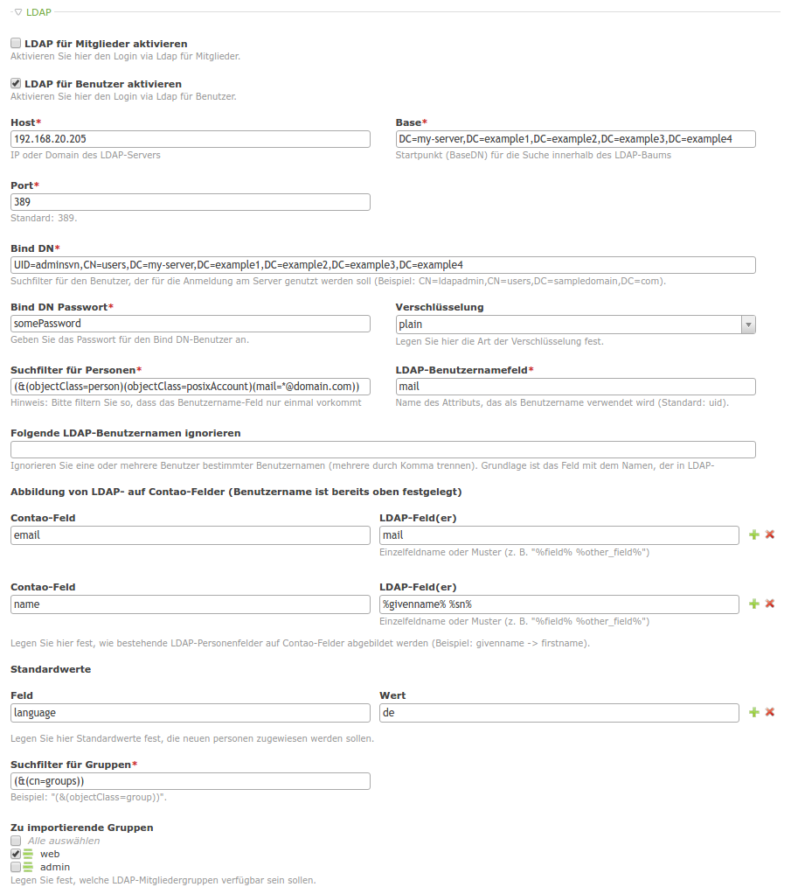

# LDAP

Adds LDAP support for frontend and backend.

## CAUTION: The module is experimental and wired to a certain ldap implementation at the moment. Nevertheless it is planned to have more flexibility:

Unfortunately a developer is very free how to configure an ldap system.
For example, the member <-> group relation can be defined member-centered, in the way that group references are stored in each
member record. Also it would be possible to do that group-centered, meaning that member references are stored in each group record.
A possible solution for this problem would be to leave it to the developer using this module to write some little hook function that
returns an array of members and groups. Each member also contains a property "groups" containing the group ids assigned to the member.

*Configuration*

## Technical instructions

- The module defines a "Person" as a contao "Member" or a "User". Both Member and User inherit from Person. This way all relevant functionality is defined in Person superclasses.
- When configuring and saving an LDAP access in tl_settings, all found members (or users) are imported as configured. One could redo this again in order to update all existing local ldap members (or users).
- Local existing members (or users) remotely non existing are disabled, not deleted.
- If LDAP groups have been selected in tl_settings, they're imported and assigned to the appropriate members (or users).
- So local copies of remotely existing members (or users) and groups are created.
- If a member (or user) tries to login with invalid credentials (i.e. credentials are really invalid or a local ldap member (or user) has not been created, yet) a local ldap copy is created on the fly.
- In the frontend "ModuleLdapLogin" has to be used for LDAP support
- The checkCredentials Hook is run everytime a LDAP member (or user) tries to login since after a successful login the password is set to some random value. This is necessary in order to keep local and remote member (or user) up to date.

### Modules

Name | Description
---- | -----------
ModuleLdapLogin | An ldap-extended login module

### Hooks

Name | Arguments | Description
---- | --------- | -----------
ldapAddPerson | $objPerson (instanceof MemberModel or UserModel), $arrSelectedGroups | Triggered after a new person has been added
ldapUpdatePerson | $objPerson (instanceof MemberModel or UserModel), $arrSelectedGroups | Triggered after a person has been updated

### Registered Contao Hooks

Name | Description
---- | -----------
importUser | Called after login credentials have been detected wrong since no local LDAP member (or user) is existing, yet
checkCredentials | Called everytime a LDAP member (or user) is detected -> used for updating local LDAP members (or users) on the fly.